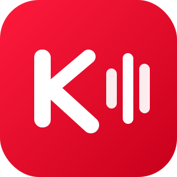
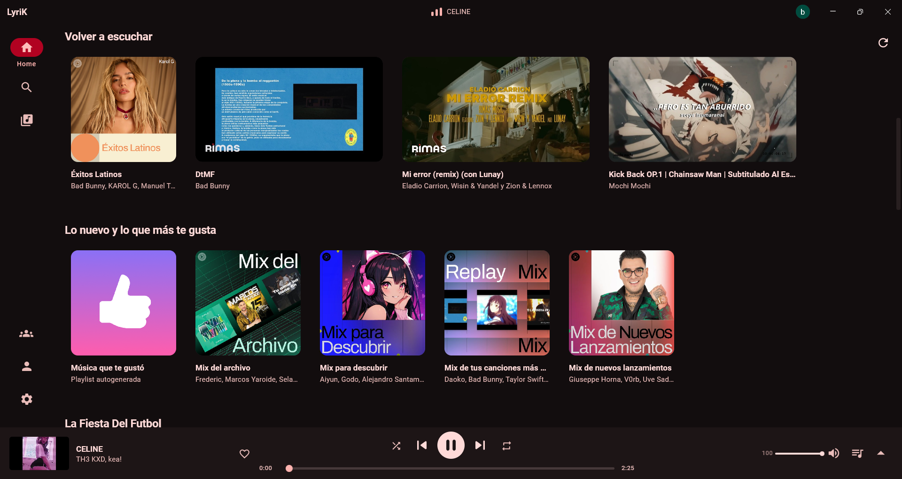
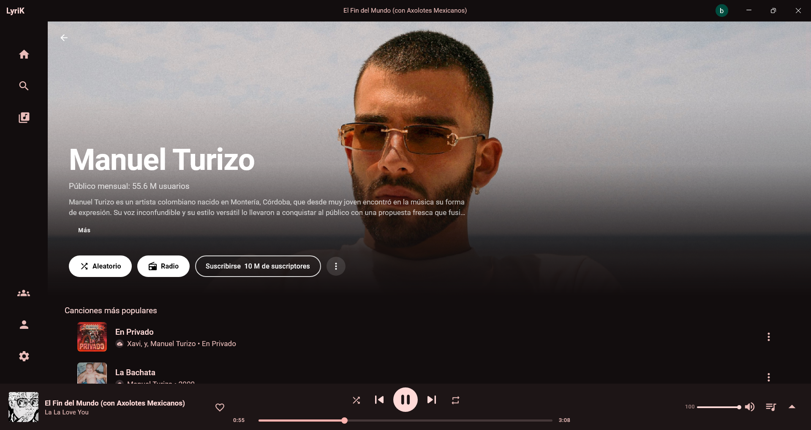
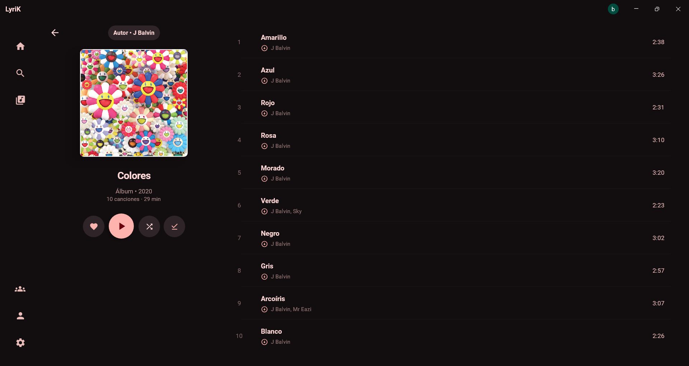
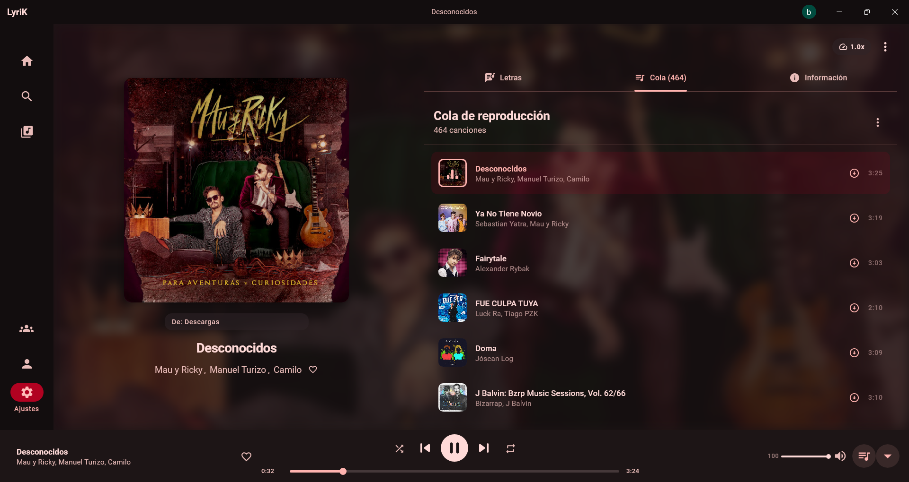
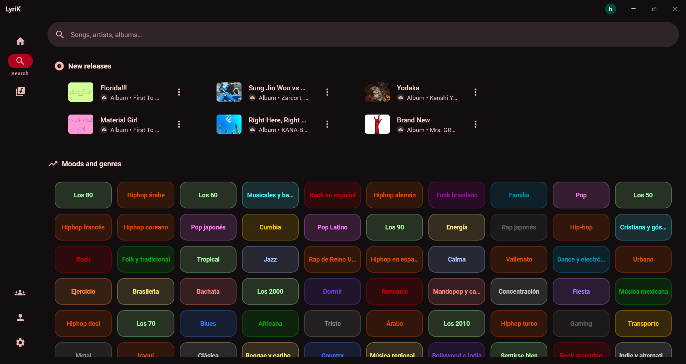
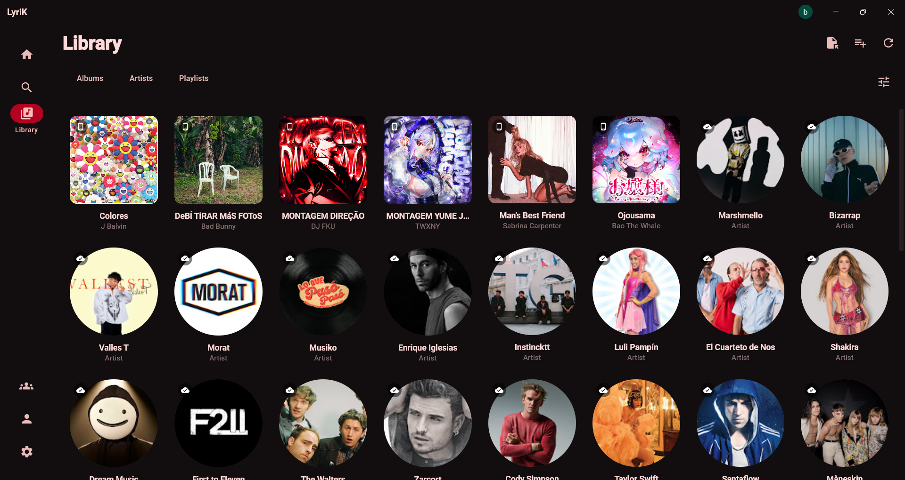
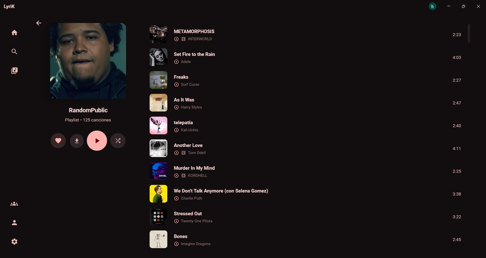

<div align="center">
  

  # MusicApp

  **Un reproductor de música de escritorio para YouTube Music — Windows (y Linux en _alpha_).**

  Streaming en alta calidad, letras sincronizadas y escucha compartida — en una interfaz limpia con temas que se adaptan a cada carátula.

  > *Nombre temporal mientras se define un nombre propio.*

  
  
  
  
  
  

  [Descargar](../../releases) · [Reportar un problema](../../issues)

  <br>

  

</div>

---

## ✨ Qué hace

- 🎧 **Streaming de YouTube Music** — canciones, álbumes y playlists, con audio nativo vía MPV (calidad máxima configurable, sin depender del reproductor embebido del navegador).
- 🎤 **Letras sincronizadas** — estilo karaoke, con resaltado palabra por palabra que sigue la canción en tiempo real (LrcLib · KuGou · BetterLyrics).
- 👥 **Escuchar juntos** — crea una sala y reproduce en sincronía con tus amigos en tiempo real, sin importar dónde estén.
- 🎨 **Tema dinámico** — los colores de la interfaz se extraen de la carátula de cada canción; con modo AMOLED, tema oscuro atenuado (DIM) y diseño en islas o compacto.
- 🔎 **Búsqueda e historial** — con biblioteca local persistente (playlists, "Me gusta", suscripciones a artistas) sincronizada de forma bidireccional con tu cuenta de YouTube Music.
- ⬇️ **Descargas y caché** — guarda canciones para escuchar sin conexión o sin gastar datos.
- ⌨️ **Integración de escritorio** — controles desde la miniatura de la barra de tareas, bandeja del sistema, tecla multimedia global (SMTC) y un overlay estilo Steam activable con atajo global.
- 🎚️ **Ecualizador de 10 bandas**, velocidad de reproducción ajustable y control fino de volumen/calidad de streaming.

---

## 📸 Capturas

<div align="center">

<!-- Hero: artist screen (la más visual) -->

<sub><b>Artista</b> · discografía, sencillos y shuffle play</sub>

<br><br>

<table>
  <tr>
    <td width="33%"><br><sub><b>Inicio</b> · recomendaciones y recientes</sub></td>
    <td width="33%"><br><sub><b>Álbum</b> · tracklist con carátula</sub></td>
    <td width="33%"><br><sub><b>Now Playing</b> · letras y cola de reproducción</sub></td>
  </tr>
  <tr>
    <td width="33%"><br><sub><b>Búsqueda</b> · géneros y novedades</sub></td>
    <td width="33%"><br><sub><b>Biblioteca</b> · álbumes, artistas y playlists</sub></td>
    <td width="33%"><br><sub><b>Playlist</b> · reproducción y gestión</sub></td>
  </tr>
</table>

</div>

---

## 🚀 Empezar

### Descargar (recomendado)

Descarga el instalador más reciente (`.msi` o `.exe`) desde la [página de releases](../../releases). El instalador te deja elegir la carpeta de instalación.

### Construir desde el código fuente

Requisitos: **JDK 21+** (se recomienda el [JetBrains Runtime](https://github.com/JetBrains/JetBrainsRuntime)).

```bash
# Ejecutar en modo desarrollo
./gradlew :composeApp:run

# Generar el instalador nativo del sistema actual
#   Windows → .msi / .exe    ·    Linux → .deb
./gradlew :composeApp:packageDistributionForCurrentOS
```

**Windows**: libmpv y yt-dlp vienen incluidos, no hay que instalar nada más. Es la
plataforma principal y la mejor soportada.

> [!WARNING]
> **Linux está en fase _alpha_.** El soporte es experimental y aún contiene diversos
> errores (integración con la bandeja del sistema, teclas multimedia, empaquetado y
> resolución de streams pueden fallar según la distro). Úsalo bajo tu propio riesgo y
> reporta lo que encuentres en los [issues](../../issues).

**Linux**: la app usa el **mpv** y **yt-dlp** del sistema (no se empaquetan, para evitar
problemas de dependencias). Instálalos con tu gestor de paquetes:

```bash
# Debian / Ubuntu — libmpv2 is the actual client library MusicApp links against;
# the "mpv" package alone doesn't pull it in.
sudo apt install mpv libmpv2 yt-dlp
# Fedora
sudo dnf install mpv-libs yt-dlp
# Arch
sudo pacman -S mpv yt-dlp
```

El indicador de la bandeja del sistema requiere `libayatana-appindicator3` (o
`libappindicator3`) en la mayoría de distros.

---

## 🛠️ Construido con

| Área | Tecnología |
|---|---|
| UI | [Compose Multiplatform](https://www.jetbrains.com/lp/compose-multiplatform/) · Material 3 · [Jewel](https://github.com/JetBrains/jewel) (ventana decorada) |
| Reproducción | [MPV](https://mpv.io/) vía JNA · [libmpv](https://github.com/mpv-player/mpv) |
| Red / API | Ktor · OkHttp · [innertube](https://github.com/MetrolistGroup/Metrolist) (cliente de YouTube Music) |
| Persistencia | SQLDelight · DataStore |
| Arquitectura | Koin (DI) · Decompose (navegación) · Kotlin Coroutines |
| Escritorio nativo | JNA (COM/Win32) · jnativehook (atajos globales) · SMTC |
| Otros | Coil 3 (imágenes) · Napier (logging) · Protobuf/WebSockets (Escuchar juntos) |

El cliente de YouTube Music (`innertube/`) se sincroniza como subtree desde [Metrolist](https://github.com/MetrolistGroup/Metrolist), adaptado para multiplataforma — ver [docs/innertube-sync.md](docs/innertube-sync.md) para el procedimiento de sincronización.

---

## 📄 Licencia

Distribuido bajo la licencia **GPL-3.0**. Consulta el archivo [LICENSE](LICENSE) para más detalles.

<div align="center">
<sub>Inspirado en <a href="https://github.com/MetrolistGroup/Metrolist">Metrolist</a>.</sub>
</div>
